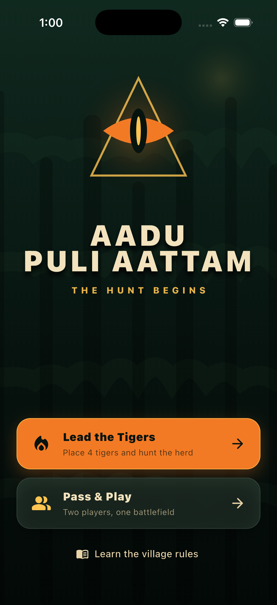
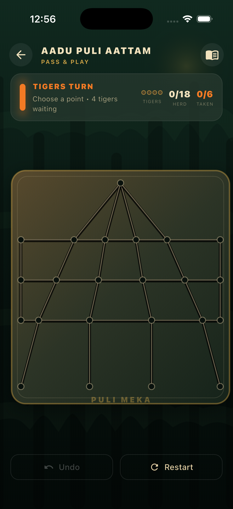

# Aadu Puli Aattam

A polished Flutter adaptation of the South Indian hunt game, built around a
documented 4-tiger and 18-goat regional ruleset.

The app is fully offline and supports Android and iOS from one codebase.

<p align="center">
  
  
</p>

## Features

- Authentic 23-point Puli Meka board based on the supplied physical board
- Four tigers against eighteen goats
- Free placement of all four tigers before the herd enters
- Single-player mode as the tigers against a defensive goat AI
- Local two-player pass-and-play mode
- Animated selections, capture bursts, board shake, and haptic impact
- Undo, restart, turn guidance, score tracking, and in-game rules
- Responsive portrait layout with a custom night-jungle visual theme
- No accounts, advertising, analytics, network access, or paid services

## Rules In This Edition

Traditional Aadu Puli Aattam rules vary between villages. This edition uses a
clear 4/18 ruleset:

1. The tiger player chooses four empty starting intersections.
2. After all four tigers enter, goats are placed one per turn.
3. Tigers move after each goat placement; goats move only after all 18 enter.
4. Pieces move one step along a connected board line.
5. A tiger captures by jumping over one adjacent goat into the empty point
   directly behind it.
6. Tigers win after capturing six goats.
7. Goats win by leaving every tiger without a legal move or capture.
8. Eighty turns without a capture produce a draw.

## Run Locally

Prerequisites: Flutter 3.44 or newer and an Android or iOS development setup.

```bash
flutter pub get
flutter run
```

## Quality Checks

```bash
dart format --output=none --set-exit-if-changed lib test
flutter analyze
flutter test
```

The test suite covers board topology, placement, movement restrictions,
captures, both victory paths, undo, AI capture priority, and the home screen.

## Project Structure

```text
lib/src/game/       Rules engine and game screen
lib/src/home/       Main menu
lib/src/widgets/    Board, pieces, background, and rules UI
lib/src/theme/      Colors and Material theme
test/               Logic and widget tests
design/             Source artwork
```

## License

MIT. See [LICENSE](LICENSE).
