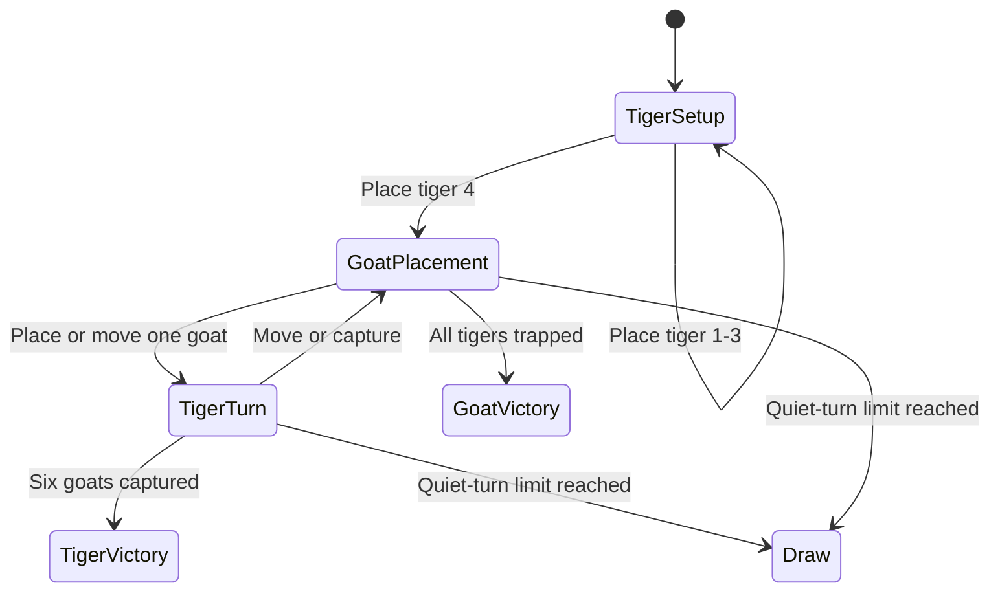

# Puli Meka Technical Guide

This document is the engineering handoff for developers and AI coding agents.
Read it before changing gameplay, board geometry, dependencies, or platform
configuration.

## 1. Product Contract

The app is an offline Flutter implementation of the supplied physical Puli
Meka board.

- Four tigers play against eighteen goats.
- The tiger player selects all four starting intersections.
- After setup, a goat turn may place a new goat or move an existing goat.
- A tiger gets one turn after each goat placement or movement.
- Tigers capture goats; goats do not capture tigers.
- Goats "attack" by surrounding the tigers and removing every legal tiger move.
- Tigers win after six captures.
- Goats win when all tigers have no legal move or capture.
- Eighty non-capturing turns produce a draw.

These are edition-specific rules. Do not silently replace them with Bagh-Chal,
the 3-tiger/15-goat Aadu Puli Aattam variant, or another regional ruleset.

Current intentional choices:

- Capturing is optional, not mandatory.
- A tiger makes at most one capture per turn.
- Chained or multiple jumps are not implemented.
- A capture must follow three consecutive points on one printed straight line.
- There is no persistence; restarting the app starts a new match.

## 2. Toolchain Snapshot

Versions verified on June 14, 2026:

| Component | Version / setting |
|---|---|
| App | `1.0.0+1` |
| Flutter | `3.44.1` stable |
| Dart | `3.12.1` |
| DevTools | `2.57.0` |
| Xcode | `26.4` (`17E192`) |
| Java runtime | OpenJDK `21.0.5` |
| Android Gradle Plugin | `9.0.1` |
| Kotlin Gradle plugin | `2.3.20` |
| Gradle wrapper | `9.1.0` |
| Android compile SDK | `36` |
| Android target SDK | `36` |
| Android minimum SDK | `24` |
| Android NDK | `28.2.13676358` |
| Android Java/Kotlin bytecode | JVM `17` |
| iOS deployment target | iOS `13.0` |
| Swift language version | `5.0` |

Flutter supplies the Android SDK and NDK defaults through
`flutter.compileSdkVersion`, `flutter.targetSdkVersion`,
`flutter.minSdkVersion`, and `flutter.ndkVersion`.

Application identifiers:

| Platform | Identifier |
|---|---|
| Android | `com.gundluru.aadu_puli_aattam` |
| iOS | `com.gundluru.aaduPuliAattam` |

## 3. Dart Packages

The runtime intentionally has no game engine, backend, analytics, ads,
database, state-management package, or network client.

Direct dependencies:

| Package | Constraint | Locked version | Purpose |
|---|---:|---:|---|
| Flutter SDK | SDK | `3.44.1` toolchain | UI, painting, animation, haptics |
| `cupertino_icons` | `^1.0.8` | `1.0.9` | Optional iOS-style icon glyphs |

Development dependencies:

| Package | Constraint | Locked version | Purpose |
|---|---:|---:|---|
| `flutter_test` | SDK | Flutter SDK | Logic and widget testing |
| `flutter_lints` | `^6.0.0` | `6.0.0` | Static analysis rules |

Important locked transitive versions include:

```text
async 2.13.1
collection 1.19.1
matcher 0.12.19
meta 1.18.0
test_api 0.7.11
vector_math 2.2.0
vm_service 15.2.0
```

`pubspec.lock` is committed and is the authoritative complete package list.
Run `flutter pub deps --style=compact` to inspect the resolved dependency tree.

## 4. Source Ownership

| Path | Responsibility |
|---|---|
| `lib/main.dart` | Orientation, system UI colors, app startup |
| `lib/src/app.dart` | Material app, theme, named game route |
| `lib/src/game/game_model.dart` | Canonical rules, board graph, state, AI, undo |
| `lib/src/game/game_screen.dart` | Turn orchestration, AI delay, haptics, dialogs |
| `lib/src/widgets/game_board.dart` | Board layout, hit targets, pieces, capture effects |
| `lib/src/home/home_screen.dart` | Main menu and mode selection |
| `lib/src/widgets/rules_sheet.dart` | Human-readable in-app rules |
| `lib/src/widgets/forest_backdrop.dart` | Procedural background painting |
| `lib/src/theme/app_theme.dart` | Colors and Material theme |
| `test/game_model_test.dart` | Board and rules regression tests |
| `test/widget_test.dart` | Home/game rendering and compact-screen tests |
| `design/app_icon.svg` | Editable app-icon source |

The model must remain independent of Flutter UI classes. This keeps gameplay
fast, deterministic, and directly testable.

## 5. Canonical Board Graph

The board has 23 intersections with IDs `0` through `22`. Coordinates in
`AaduPuliGame.nodes` are normalized UI positions. The IDs and ordered lines are
the rules contract.

Approximate ID layout:

```text
                         0

1 -------- 2 --- 3 --- 4 --- 5 -------- 6
|         /      |     |      \         |
7 ----- 8 ----- 9 --- 10 ---- 11 ----- 12
|      /        /       \        \       |
13 -- 14 ---- 15 ------- 16 ---- 17 --- 18
      /        |          |        \
     19 ------ 20 ------- 21 ------ 22
```

Use the ordered `boardLines` below rather than inferring connectivity from the
ASCII diagram:

```text
[1, 2, 3, 4, 5, 6]       upper horizontal
[7, 8, 9, 10, 11, 12]    middle horizontal
[13, 14, 15, 16, 17, 18] lower horizontal
[19, 20, 21, 22]          base horizontal
[1, 7, 13]                left outer rail
[6, 12, 18]               right outer rail
[0, 2, 8, 14, 19]         left ray
[0, 3, 9, 15, 20]         inner-left ray
[0, 4, 10, 16, 21]        inner-right ray
[0, 5, 11, 17, 22]        right ray
```

`_buildAdjacency()` connects consecutive IDs on every line. `_buildJumpPaths()`
uses every consecutive triple `(source, middle, target)` in both directions.
Therefore:

- A normal move uses one adjacency edge.
- A capture requires a goat at `middle` and an empty `target`.
- Changing line order changes capture behavior.
- Adding a visual line only in the painter creates a non-playable line.
- Adding connectivity only in the model creates an invisible legal move.

When modifying the board, update together:

1. `nodes`
2. `boardLines`
3. `game_board.dart` only if visual framing must change
4. Board topology and capture tests
5. This section and the in-app rules when behavior changes

## 6. Match State Machine

`AaduPuliGame` stores mutable match state. Widgets rebuild after a successful
model operation.



Important fields:

| Field | Meaning |
|---|---|
| `pieces` | Map from node ID to `PieceType` |
| `turn` | Side allowed to act |
| `tigersPlaced` | Setup progress, maximum four |
| `goatsPlaced` | Total goats introduced, including later-captured goats |
| `goatsCaptured` | Tiger score |
| `selectedNode` | Currently selected movable piece |
| `lastFrom`, `lastTo` | Last move highlight |
| `lastCaptured` | Capture-effect origin |
| `quietTurns` | Consecutive placements/moves without a capture |
| `winner` | Terminal result or `null` |

Input enters through `selectOrAct(node)`:

1. During tiger setup, an empty node places a tiger.
2. During goat placement, tapping a goat selects it for movement.
3. During goat placement, an empty node places a goat when no selected goat
   has a legal move to that node.
4. During movement, tapping an owned piece selects it.
5. Tapping a legal highlighted destination calls `applyAction`.

All externally supplied actions are revalidated in `applyAction`; callers
cannot bypass legal-move generation by constructing an arbitrary `GameAction`.

## 7. Game Modes And AI

`GameMode.vsGoatAi`:

- The human always controls the tigers.
- The human selects all four tiger starting points.
- The current goat AI places all eighteen goats before using movement turns.
- A human goat player may move an existing goat before all eighteen are placed.
- Input is blocked while the AI timer is running.
- Undo normally removes both the AI response and the preceding human action.

`GameMode.passAndPlay`:

- One local player controls tigers.
- The other local player controls goats.
- Undo removes one action.

The goat AI is deterministic and heuristic-based, not machine learning:

- `chooseGoatAiPlacement()` scores every empty node.
- It values connected points and positions near tigers.
- It penalizes placements that immediately become jumpable.
- `chooseGoatAiAction()` simulates each legal goat move.
- It prefers moves that reduce the number of legal tiger actions.
- Small deterministic tie-break values prevent repetitive first-index choices.

When improving AI, do not mutate permanent game state during scoring. Temporary
simulation in `_scoreGoatMove()` must always restore `pieces` before returning.
For deeper search, prefer cloning a lightweight model state over allowing UI
code into the model.

## 8. Rendering And Interaction

The board is not an image. It is rendered with Flutter primitives:

- `GameBoard` converts normalized node coordinates into screen positions.
- Each node receives a larger transparent `GestureDetector` hit target.
- `_BoardPainter` draws the slab, graph lines, nodes, last move, and burst.
- `_PiecePainter` draws original tiger and goat tokens.
- `ForestBackdrop` draws the background procedurally.

No external runtime image or font asset is needed. The app icon PNGs are
generated from `design/app_icon.svg` and stored in the native platform folders.

Capture feedback combines:

- `HapticFeedback.heavyImpact()`
- A 520 ms radial burst around the captured node
- Horizontal board shake

Keep portrait layouts working at a minimum tested logical size of `320x568`.

## 9. Testing Contract

Required before committing gameplay or UI changes:

```bash
dart format --output=none --set-exit-if-changed lib test
flutter analyze
flutter test
```

Build verification:

```bash
flutter build apk --debug
flutter build ios --simulator
```

Current model tests verify:

- 23 nodes and canonical board lines
- Free placement of all four tigers
- Goat placement and turn transfer
- Goat movement before all eighteen goats are placed
- Straight-line tiger capture
- Six-capture tiger victory
- Trapped-tiger goat victory
- Undo during tiger deployment
- Goat AI selecting a valid empty node

Widget tests verify:

- Both home-screen game modes
- Compact home layout
- Compact game layout without overflow

Any rules change needs both a positive test and, where useful, a rejection test.
Examples: illegal non-adjacent move, blocked landing point, goat movement during
placement, or capture across points that are not consecutive on one board line.

## 10. Common Change Procedures

### Change a win threshold

Update the constant in `AaduPuliGame`, UI counter text if necessary, rules
sheet, README, this guide, and victory tests.

### Add mandatory captures

This is a rule change, not a UI-only filter. Update legal action generation so
non-capturing tiger moves are excluded when any capture exists, then add tests.

### Add multiple jumps

The current turn ends after one `applyAction`. Multiple jumps require explicit
continuation state, selecting the same tiger again, and delaying `_finishTurn`
until the chain ends.

### Add persistence

Do not serialize private snapshots. Define a public versioned save model for
pieces, counters, turn, and winner. Validate node IDs and piece counts when
loading untrusted data.

### Add online play

Keep the local model authoritative for validation. Transmit actions or
versioned snapshots, authenticate players, and reject moves that do not match
the server-side expected turn and state revision.

### Add another regional ruleset

Create an explicit rules/configuration type. Do not add scattered mode checks
through the painter and screen. Board graph, piece counts, setup, capture
threshold, mandatory-capture behavior, and multi-jump behavior should be
configuration inputs or separate rule implementations.

## 11. Known Limitations

- No save/resume.
- No online multiplayer.
- No sound effects or music.
- No localization.
- No accessibility semantics dedicated to individual board points.
- AI uses one-ply heuristics and can be strategically weak.
- Release signing and store metadata are not configured.
- Android release currently uses the debug signing configuration.

## 12. Agent Checklist

Before editing:

1. Read `game_model.dart` and the relevant tests.
2. Identify whether the request changes rules, presentation, or both.
3. Preserve the supplied 23-point Puli Meka board unless explicitly asked.
4. Do not introduce a package when the Flutter SDK already provides the need.

After editing:

1. Update model tests for every behavior change.
2. Update widget tests for layout or navigation changes.
3. Keep README, in-app rules, and this guide consistent.
4. Run format, analysis, tests, and applicable platform builds.
5. Visually inspect gameplay after board, painter, or responsive-layout work.
